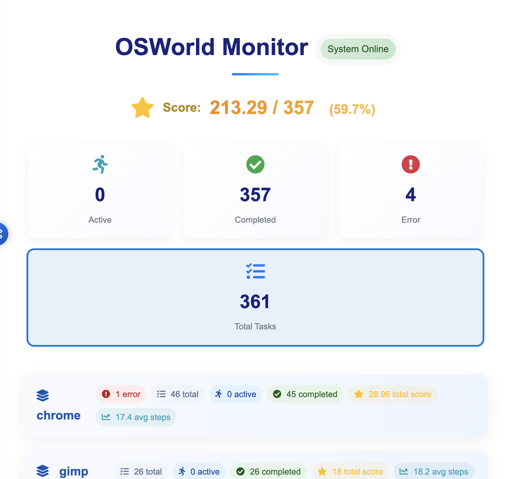

<p align="center">
   
</p>

<h1 align="center">TuriX · Desktop Actions, Driven by AI</h1>

<p align="center"><strong>Talk to your computer, watch it work.</strong></p>

## 📞 Contact & Community

Join our Discord community for support, discussions, and updates:

<p align="center">
   <a href="https://discord.gg/yaYrNAckb5">
      
   </a>
</p>

Or contact us with email: contact@turix.ai

TuriX lets your powerful AI models take real, hands‑on actions directly on your desktop. 
It ships with a **state‑of‑the‑art computer‑use agent** (passes > 68 % of our internal OSWorld‑style test set) yet stays 100 % open‑source and cost‑free for personal & research use.  

Prefer your own model? **Change in `config.json` and go.**

## Table of Contents
- [📞 Contact & Community](#-contact--community)
- [📰 Latest News](#-latest-news)
- [🖼️ Demos](#️-demos)
- [✨ Key Features](#-key-features)
- [📊 Model Performance](#-model-performance)
- [🚀 Quick‑Start (macOS 15+)](#-quickstart-macos-15)
   - [1. Download the App](#1-download-the-app)
   - [2. Create a Python 3.12 Environment](#2-create-a-python-312-environment)
   - [3. Grant macOS Permissions](#3-grant-macos-permissions)
      - [3.1 Accessibility](#31-accessibility)
      - [3.2 Safari Automation](#32-safari-automation)
   - [4. Configure & Run](#4-configure--run)
- [🤝 Contributing](#-contributing)
- [🗺️ Roadmap](#️-roadmap)

---

## 📰 Latest News

**October 16, 2025** - 🚀 Big news for automation enthusiasts! TuriX now fully supports the cutting-edge **Qwen3-VL** vision-language model, empowering seamless PC automation across both **macOS** and **Windows**. This integration boosts task success rates by up to 15% on complex UI interactions (based on our internal benchmarks), making your desktop workflows smarter and faster than ever. Whether you're scripting daily routines or tackling intricate projects, Qwen3-VL's advanced multimodal reasoning brings unparalleled precision to the table.

*Stay tuned to our [Discord](https://discord.gg/vkEYj4EV2n) for tips, user stories, and the next big drop.*

---

## 🖼️ Demos
<h3 align="center">MacOS Demo</h3>
<p align="center"><strong>Book a flight, hotel and uber.</strong></p>
<p align="center">
   
</p>

<p align="center"><strong>Search iPhone price, create Pages document, and send to contact</strong></p>
<p align="center">
   
</p>

<p align="center"><strong>Generate a bar-chart in the numbers file sent by boss in discord and insert it to the right place of my powerpoint, and reply my boss.</strong></p>
<p align="center">
   
</p>

<h3 align="center">Windows Demo</h3>
<p align="center"><strong>Search video content in youtube and like it</strong></p>
<p align="center">
   
</p>

<h3 align="center">MCP with Claude Demo</h3>
<p align="center"><strong>Claude search for AI news, and call TuriX with MCP, write down the research result to a pages document and send it to contact</strong></p>
<p align="center">
   
</p>

---

## ✨ Key Features
| Capability | What it means |
|------------|---------------|
| **SOTA default model** | Outperforms previous open‑source agents (e.g. UI‑TARS) on success rate and speed on Mac |
| **No app‑specific APIs** | If a human can click it, TuriX can too—WhatsApp, Excel, Outlook, in‑house tools… |
| **Hot‑swappable "brains"** | Replace the VLM policy without touching code (`config.json`) |
| **MCP‑ready** | Hook up *Claude for Desktop* or **any** agent via the Model Context Protocol (MCP) |

---
## 📊 Model Performance

Our agent achieves state-of-the-art performance on desktop automation tasks:

### OSWorld Benchmark — 3rd Place on the Leaderboard (50 Steps)

TuriX scores **59.7% (213.29 / 357)** on the full OSWorld benchmark, ranking **3rd overall** among all submitted agents. Notably, TuriX is built and optimized for **macOS**, where we achieve an **80%+ success rate** on our self-hosted OSWorld-style Mac benchmark. We used **zero Linux training data**, yet still achieve a top-3 finish on OSWorld's Linux-based environment.

<p align="center">
   
</p>

<p align="center">
   
</p>

For more details, check our [report](https://turix.ai/technical-report/).

## 🚀 Quick‑Start (macOS 15+)

> **We never collect data**—install, grant permissions, and hack away.

> **0. Windows Users**: Switch to the `windows` branch for Windows-specific setup and installation instructions.
>
> ```bash
> git checkout windows
> ```


### 1. Download the App
For easier usage, [download the app](https://www.ngtechai.com/)

Or follow the manual setup below:

### 2. Create a Python 3.12 Environment
Firstly Clone the repository and run:
```bash
conda create -n turix_env python=3.12
conda activate turix_env        # requires conda ≥ 22.9
pip install -r requirements.txt
```

### 3. Grant macOS Permissions

#### 3.1 Accessibility
1. Open **System Settings ▸ Privacy & Security ▸ Accessibility**  
2. Click **＋**, then add **Terminal** and **Visual Studio Code** ANY IDE you use
3. If the agent still fails, also add **/usr/bin/python3**

#### 3.2 Safari Automation
1. **Safari ▸ Settings ▸ Advanced** → enable **Show features for web developers**  
2. In the new **Develop** menu, enable  
    * **Allow Remote Automation**  
    * **Allow JavaScript from Apple Events**  

##### Trigger the Permission Dialogs (run once per shell)
```
# macOS Terminal
osascript -e 'tell application "Safari" \
to do JavaScript "alert(\"Triggering accessibility request\")" in document 1'

# VS Code integrated terminal (repeat to grant VS Code)
osascript -e 'tell application "Safari" \
to do JavaScript "alert(\"Triggering accessibility request\")" in document 1'
```

> **Click "Allow" on every dialog** so the agent can drive Safari.

### 4. Configure & Run

#### 4.1 Edit Task Configuration

> [!IMPORTANT]
> **Task Configuration is Critical**: The quality of your task instructions directly impacts success rate. Clear, specific prompts lead to better automation results.

Edit task in `examples/config.json`:
```json
{
    "agent": {
         "task": "open system settings, switch to Dark Mode"
    }
}
```

#### 4.2 Edit API Configuration

Edit API in `examples/config.json`:
```json
"llm": {
      "provider": "turix",
      "api_key": "YOUR_API_KEY",
      "base_url": "https://your-endpoint/v1"
   }
```

#### 4.3 Configure Custom Models (Optional)

If you want to use other models not defined by the build_llm function in the main.py, you need to first define it, then setup the config.

main.py:

```
if provider == "name_you_want":
        return ChatOpenAI(
            model="gpt-4.1-mini", api_key=api_key, temperature=0.3
        )
```
Switch between ChatOpenAI, ChatGoogleGenerativeAI and ChatAnthropic base on your llm. Also change the model name.

#### 4.4 Start the Agent

```bash
python examples/main.py
```

**Enjoy hands‑free computing 🎉**

### 5. MCP Support

TuriX support [Model Context Protocol](https://modelcontextprotocol.io/overview). You can use Claude for Desktop to call TuriX as a MCP Server with the following configuration(assume you have turix_env conda env): 
```json
{
  "mcpServers": {
    "mcp_agent": {
      "command": "/ABSOLUTE/PATH/TO/YOUR/CONDA/ENV/bin/python",
      "args": [
        "/ABSOLUTE/PATH/TO/FOLDER/TuriX-CUA/src/mcp/mcp_server.py"
      ],
      "env": {
        "LLM_PROVIDER": "turix",
        "LLM_MODEL":   "turix-model",
        "LLM_TEMP":    "0",
        "OPENAI_API_KEY":  "YOUR_KEY_HERE",
        "OPENAI_API_BASE": "YOUR_BASE_URL",
        "MCP_TIMEOUT_SEC": "600"
      }
    }
  }
}
```
You can also setup your llm model by change the env in the json file. MCP_TIMEOUT_SEC is the time limit, if the task running time larger than the setting value, the task will be terminated.

If you wanna terminate the agent while running, press cmd+shift+2.

## 🤝 Contributing

We welcome contributions! Please read our [Contributing Guide](CONTRIBUTING.MD) to get started.

Quick links:
- [Development Setup](CONTRIBUTING.MD#development-setup)
- [Code Style Guidelines](CONTRIBUTING.MD#code-style-guidelines)
- [Testing](CONTRIBUTING.MD#testing)
- [Pull Request Process](CONTRIBUTING.MD#pull-request-process)

For bug reports and feature requests, please [open an issue](https://github.com/TurixAI/TuriX-CUA/issues).

## 🗺️ Roadmap

| Quarter | Feature | Description |
|---------|---------|-------------|
| **2025 Q3** | **✅ Windows Support** | Cross-platform compatibility bringing TuriX automation to Windows environments *(Now Available)* |
| **2025 Q3** | **✅ Enhanced MCP Integration** | Deeper Model Context Protocol support for seamless third-party agent connectivity *(Now Available)*|
| **2025 Q4** | **✅ Next-Gen AI Model** | Significantly improved clicking accuracy and task execution capabilities |
| **2025 Q4** | **✅ Support Gemini-3-pro model** | Run with any compatible vision language models |
| **2025 Q4** | **Planner** | Understands user intent and makes step-by-step plans to complete tasks |
| **2025 Q4** | **Multi-Agent Architecture** | Evaluate and guide each step in working |
| **2025 Q4** | **Workflow Automation** | Record, edit, and replay complex multi-step automation sequences |
| **2026 Q1** | **Offline Model Option** | Fully local inference for maximum privacy and zero API dependency |
| **2026 Q1** | **Persistent Memory** | Learn user preferences and maintain task history across sessions |
| **2026 Q2** | **Learning by Demonstration** | Train the agent by showing it your preferred methods and workflows |
| **2026 Q2** | **Windows-Optimized Model** | Native Windows model architecture for superior performance on Microsoft platforms
